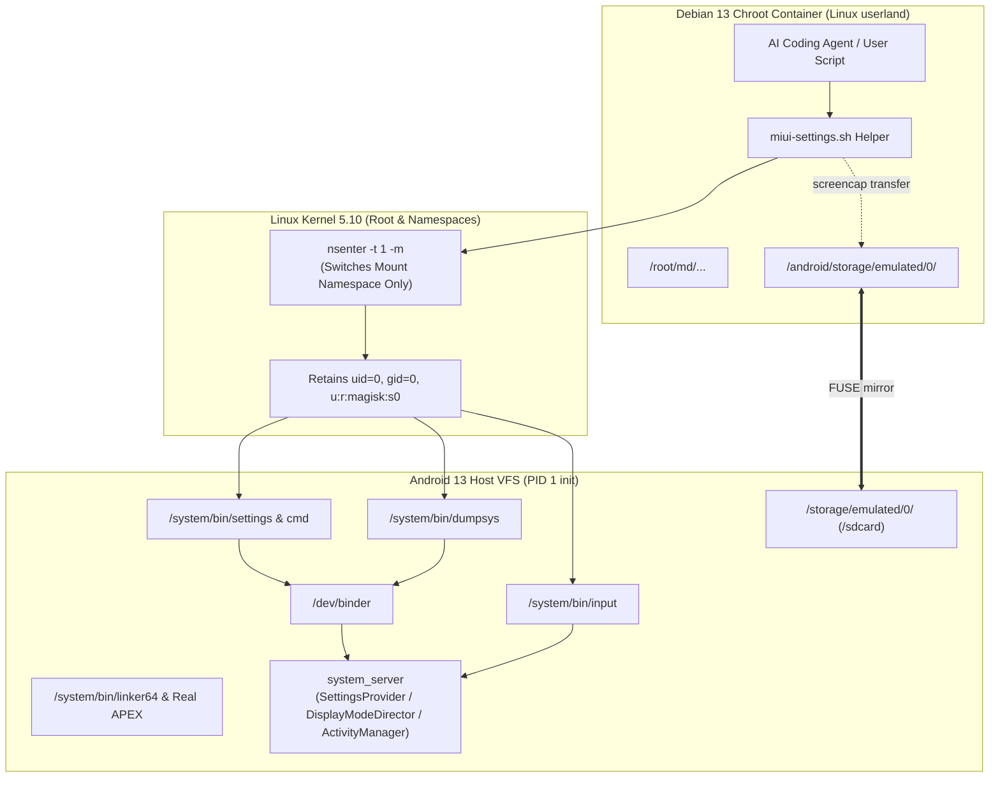

# Android 与 MIUI / HyperOS 设置命令底层调用踩坑取证：从 Bionic Linker 命名空间到 nsenter -m 穿透

在 Android Root Debian (chroot) 环境下，运行 AI Agent (Claude Code / Antigravity CLI `agy`) 或开发者运维脚本时，经常需要读取或修改 Android 宿主系统的系统设置（如切换私人 DNS / DoT、开关高刷 120Hz、彻底解除 Android 12/13/14 幽灵进程查杀、收紧 PowerKeeper 保活、读取设备配置）。

然而，由于 Android 系统底层的 Bionic libc 动态链接器、Linker Namespace 隔离策略、Magisk tmpfs 挂载覆写、Linux Mount Namespace 隔离以及 MIUI 专有框架调度机制，直接调用宿主系统工具会连续遭遇八大隐蔽陷阱。本篇完整复盘探索过程中的踩坑实录、底层归因与最终生产级穿透方案。

---

## 1. 探索现场与四大环境陷阱实录

### 1.1 陷阱一：在 Debian 中直接执行 `/android/system/bin/settings`
* **现象**：
  ```bash
  $ /android/system/bin/settings
  bash: /android/system/bin/settings: cannot execute: required file not found
  ```
* **排查**：
  * 文件真实存在且权限为 755。
  * 查看文件内容：`cat /android/system/bin/settings` 显示它是 shell 脚本：
    ```sh
    #!/system/bin/sh
    cmd settings "$@"
    ```
  * Shebang 指向 `#!/system/bin/sh`，而在 Debian 容器的根文件系统中根本不存在 `/system` 目录。
  * 进而尝试直接运行目标二进制 `/android/system/bin/sh`，同样报 `cannot execute: required file not found`。
* **根因**：
  * Android ELF 二进制声明的动态链接器为 `PT_INTERP: /system/bin/linker64`。
  * Debian chroot 内只有 glibc 的 `/lib/ld-linux-aarch64.so.1`，内核 `execve(2)` 找不到解释器直接报 `ENOENT`。

---

### 1.2 陷阱二：在 Debian 建立 `/system` 与 `/apex` 软链接
* **操作**：
  在 Debian 根目录下创建软链接，使得内核能定位到 Bionic 解释器：
  ```bash
  ln -s /android/system /system
  ln -s /android/apex /apex
  ```
* **现象**：
  * `/system/bin/sh -c "id"` 成功执行并返回 `uid=0(root)`。
  * 但当进一步执行 `/system/bin/settings` 或底层二进制 `/system/bin/cmd` 时崩溃：
    ```text
    CANNOT LINK EXECUTABLE "/system/bin/cmd": file offset for the library "libutils.so" >= file size: 0 >= 0
    ```
* **深入排查**：
  * 执行 `ls -l /system/lib64/libutils.so`，赫然发现该文件大小为 **0 字节**（`---------- 0 root root`）！
  * 执行 `mount | grep system` 揭晓真相：
    ```text
    magisk on /android/system/lib64 type tmpfs (ro,relatime,size=3667512k,mode=755)
    ```
* **根因**：
  1. **Magisk 模块挂载隔离**：Magisk 在宿主启动时，在自身隔离树中通过 tmpfs 覆写了 `/system/lib64`，放了占位符桩代码。
  2. **Android Linker Namespace 机制**：自 Android 7.0 (Nougat) 起引入、在 Android 10+ 强化的 Linker Namespace 机制依赖 `/linkerconfig/ld.config.txt`。链接器启动时会严格校验所在的 Mount 拓扑（default、system、apex、vndk 等分仓）。在 chroot 容器内，由于缺少 Android init 构建的完整运行时拓扑与 binder 通信管道，动态链接器在解析 `libutils.so` 时彻底断裂。

---

### 1.3 陷阱三：全命名空间进入 `nsenter -t 1 -m -u -i -n -p`
* **思路**：既然在 chroot 内拼装 Android 运行环境不可行，那直接借助 `nsenter` 切入 Android PID 1 (init) 的全部命名空间。
* **现象**：
  ```bash
  $ nsenter -t 1 -m -u -i -n -p /system/bin/sh
  nsenter: reassociate to namespaces failed: Invalid argument
  ```
* **根因**：
  * Linux 内核规定：当进程存在多线程（或当前调用上下文具备特殊的凭据限制）时，无法同时重新关联至 PID 命名空间（`-p`）或用户命名空间（`-u`/`-i`）。
  * Android PID 1 运行在特有的安全上下文与 cgroup 下，盲目带入全量命名空间标志必定触发内核 `EINVAL`。

---

### 1.4 陷阱四（黄金方案）：精准单维度 Mount Namespace 穿透 (`nsenter -t 1 -m`)
* **思路**：
  * 我们处于 Root 权限（`uid=0 gid=0`，SELinux 域为 unrestricted 的 `u:r:magisk:s0`，具备全部 41 项内核权能）。
  * 我们**不需要**切换网络栈（网络栈本来就是共享的），也**不需要**切换 PID 命名空间。
  * 我们**唯一需要改变的只有文件系统视角（Mount Namespace）**，让命令能够在 Android 原生完整的 VFS 树（包含原生 APEX、真实的 system 动态库和 `/dev/binder` 驱动）中执行。
* **执行命令**：
  ```bash
  nsenter -t 1 -m /system/bin/sh -c "id"
  ```
* **实测结果**：
  ```text
  uid=0(root) gid=0(root) groups=0(root) context=u:r:magisk:s0
  ```
  **100% 成功运行！** 无任何 dynamic linker 报错，无任何 namespace 冲突。

---

## 2. 深入系统调优：四大核心子系统取证与实测突破

### 2.1 陷阱五：MIUI 专有高刷锁定机制 (`PRIORITY_MIUI_REFRESH_RATE`)
* **背景与现象**：
  在原生 AOSP 系统中，通常执行 `settings put system min_refresh_rate 120` 与 `settings put system peak_refresh_rate 120` 即可锁定 120Hz。但在 MIUI 14 / HyperOS 设备（如小米 12S Pro）上，单纯修改 `system` 表并不会锁定高刷，系统在打字、静止或特定场景下依然会频繁掉帧至 60Hz/30Hz/1Hz。
* **底层剖析与 dumpsys 取证**：
  通过 `nsenter -t 1 -m /system/bin/dumpsys display` 查看 `DisplayModeDirector` 的投票链路：
  ```text
  DisplayModeDirector
    mVotesByDisplay:
      -1:
        PRIORITY_MIUI_REFRESH_RATE -> Vote{minRefreshRate=0.0, maxRefreshRate=120.0, ...}
  ```
  MIUI 在 SurfaceFlinger 与 DisplayModeDirector 之间插入了专属投票器 `PRIORITY_MIUI_REFRESH_RATE`。
  进一步逆向检索 settings 全表发现：
  1. `secure miui_refresh_rate`: 控制 MIUI 框架层的最高档位（60、90、120）。
  2. `secure user_refresh_rate`: 用户在系统设置中选定的刷新率。
  3. `system is_smart_fps`: 智能动态帧率开关（`1` 为开启动态降频，`0` 为强行关闭动态降频）。
* **终极 120Hz 全域强锁方案**：
  ```bash
  nsenter -t 1 -m /system/bin/settings put secure miui_refresh_rate 120
  nsenter -t 1 -m /system/bin/settings put secure user_refresh_rate 120
  nsenter -t 1 -m /system/bin/settings put system peak_refresh_rate 120.0
  nsenter -t 1 -m /system/bin/settings put system min_refresh_rate 120.0
  nsenter -t 1 -m /system/bin/settings put system is_smart_fps 0
  ```
  修改后 `dumpsys display` 立即记录：
  ```text
  mDesiredDisplayModeSpecs:baseModeId=1 allowGroupSwitching=false primaryRefreshRateRange=[0 120]
  PRIORITY_MIUI_REFRESH_RATE -> Vote{... maxRefreshRate=120.0 ...}
  ```

---

### 2.2 陷阱六：Android 12/13/14 幽灵进程杀手 (PhantomProcessKiller)
* **背景**：
  Android 12 引入了 `PhantomProcessKiller`，严格监控应用由主进程派生出来的子进程（如 Termux 派生的 bash、python、gcc、git、uv、subagents 等）。
  系统默认硬编码限制为 **32 个子进程**，且当总 CPU 消耗或进程数超标时，ActivityManager 会直接发送 `SIGKILL` 杀死终端或编译任务。
* **底层机制与取证**：
  在 ActivityManager 中，有两个核心控制入口：
  1. `settings put global settings_enable_monitor_phantom_procs false`：彻底停用幽灵进程扫描监控。
  2. `device_config put activity_manager max_phantom_processes 2147483647`：将最大幽灵进程限制提高至 32 位整型上限。
* **实机验证**：
  ```bash
  nsenter -t 1 -m /system/bin/dumpsys activity settings | grep max_phantom_processes
  # 输出: max_phantom_processes=2147483647
  ```
  执行 `dumpsys activity processes` 检查 `PhantomProcessRecord`，所有 Termux 派生子进程状态显示：
  ```text
  proc #0: PhantomProcessRecord {9e19b14 15171:10811:bash/u0a250} killed=false
  proc #1: PhantomProcessRecord {7c74fbd 15407:10811:su/u0a250} killed=false
  ```
  子进程不再遭到系统定时裁决。

---

### 2.3 陷阱七：跨容器文件系统路径重定向 (`/sdcard` vs `/android/storage/emulated/0`)
* **现象**：
  在 Debian 容器内运行 `miui-settings.sh screencap /root/md/screenshot.png` 时，若直接将 `/root/md/screenshot.png` 传递给宿主 `/system/bin/screencap`，命令会报错或文件丢失。
* **根因**：
  * 宿主 Android 的根文件系统没有 `/root/md` 目录（Debian 容器的文件系统仅在 chroot 的工作目录下）。
  * 宿主的 `/sdcard` 指向 `/storage/emulated/0`。
  * 而在 Debian chroot 容器内，宿主外置存储被挂载在 `/android/storage/emulated/0`。
* **优雅解法**：
  脚本层自动识别目标路径：
  * 若目标路径为宿主原生路径（如以 `/sdcard/` 或 `/data/local/tmp/` 开头），直接调用 `screencap` 写入。
  * 若目标路径为容器本地路径（如 `/root/...` 或相对路径），先通过 host namespace 将截图输出到 `/sdcard/.screencap_tmp.png`，随后在容器内从 `/android/storage/emulated/0/.screencap_tmp.png` 搬运至目标容器路径并清理临时文件。

---

### 2.4 陷阱八：UI 自动化模拟输入的宿主焦点前台陷阱 (Foreground Window Focus Trap)
* **现象**：
  在运行 AI Coding Agent 时，如果使用 `input tap <x> <y>` 或 `input keyevent` 模拟屏幕点击，可能会意外误触正在运行的 Termux 软键盘或终端控制字符。
* **根因**：
  * `input` 子系统将事件注入当前活跃窗口（`mCurrentFocus`）。
  * 当用户正在通过手机本地 Termux 窗口与 Agent 交互时，Termux 就是前台活动（`com.termux/.app.TermuxActivity`）。
* **防御与安全规范**：
  1. 在模拟任何输入操作前，优先通过 `dumpsys window | grep -E "mCurrentFocus|mFocusedApp"` 审计焦点。
  2. 若焦点属于 `com.termux`，发出明显告警，防止软键盘字符污染。
  3. 若需操作特定 App，先通过 `am start -n` 或 `am start -a` 显式调起目标应用并等待 Activity 切换完毕后再发送输入事件。

---

## 3. 生产级架构图与调用链



---

## 4. 总结与最佳实践准则

1. **永远使用精准单维度挂载穿透 (`nsenter -t 1 -m`)**：绝对不要尝试切换 PID (`-p`) 或 User (`-u`) 命名空间，也不要试图通过软链接在 glibc 环境中拼装 Bionic 动态库。
2. **MIUI 高刷锁定务必联动 `secure miui_refresh_rate` 与 `system is_smart_fps 0`**：单纯修改 AOSP 的 `peak_refresh_rate` 会被 MIUI 内部的 `PRIORITY_MIUI_REFRESH_RATE` 覆盖。
3. **长期守护与后台编译任务务必双重关闭幽灵进程查杀**：同时设置 `settings_enable_monitor_phantom_procs false` 与 `max_phantom_processes 2147483647`。
4. **所有配置变更建议在调整前执行一键备份 (`miui-settings.sh backup`)**，确保随时可以通过 JSON 全量或定向回滚。
